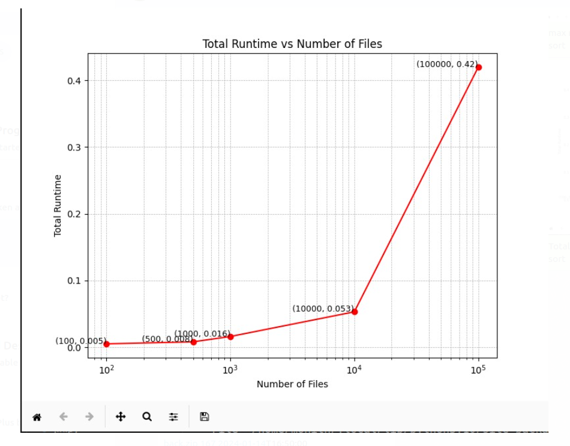
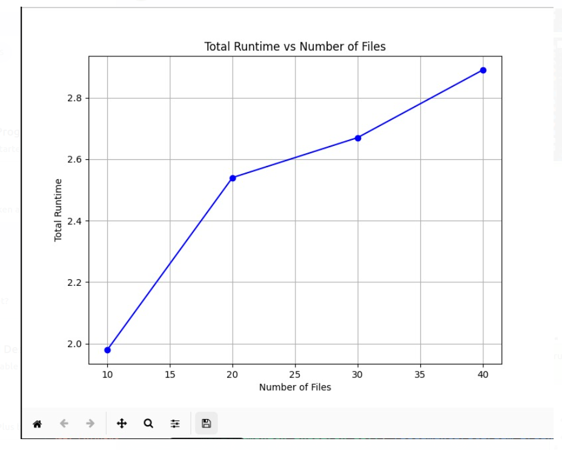
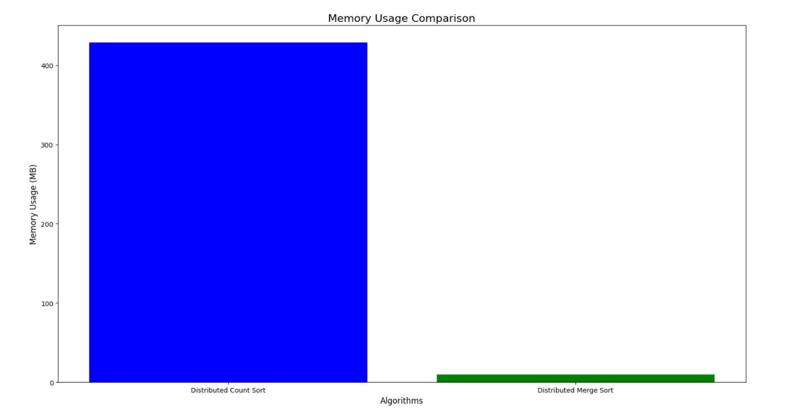
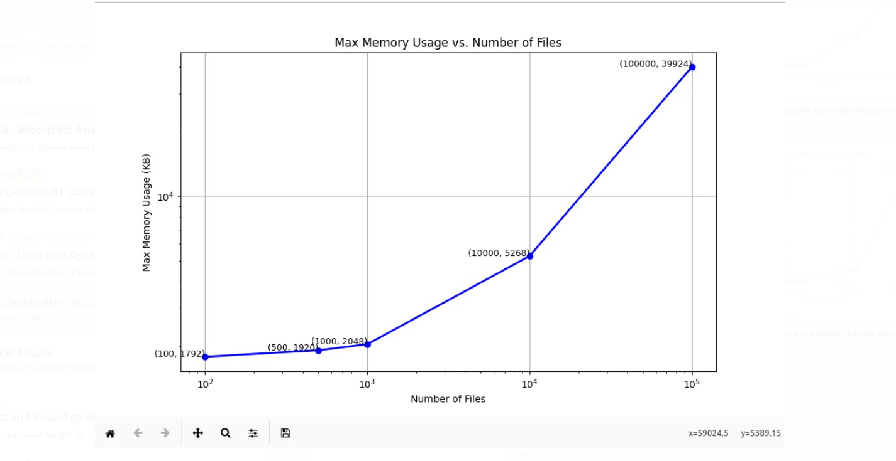
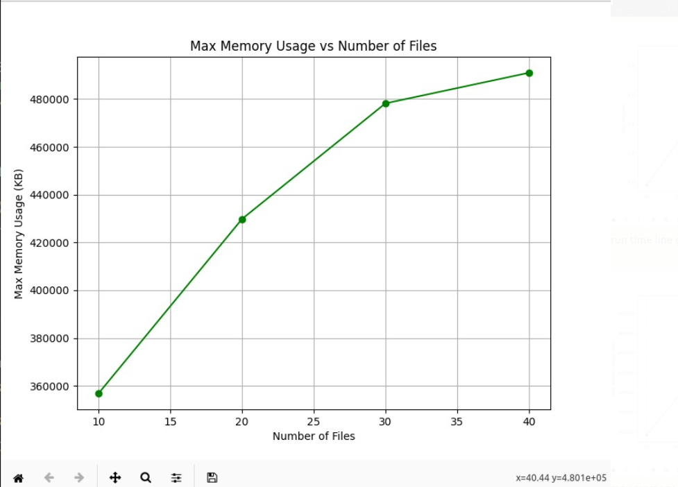

# XV6_and_Concurrency

## Part 1: Distributed Sorting System Performance
## 1.Implementation Analysis :

### 1. **Task Distribution for Parallel Sorting (Count Sort and Merge Sort)**

#### Count Sort(Parallel):
- Divides the input into equal chunks for each thread, with each thread handling its portion of the count array. After processing, threads combine the counts into a global array.
  - **Pros**: 
    - Scalable and efficient for large datasets.
    - Independent tasks for each thread.
  - **Cons**: 
    - High overhead in thread creation.
    - Memory usage for count arrays.

#### Merge Sort (Parallel):
- Each thread sorts a portion of the array, and after sorting, subarrays are merged. The final merge step ensures all subarrays are combined correctly.
  - **Pros**:
    - Efficient parallelization as threads can independently sort chunks.
  - **Cons**: 
    - Merging can become a bottleneck.
    - Sequential process for merging, leading to diminishing returns on very large datasets.

### 2. **Task Distribution for Merge Sort (Distributed)**

- **Divide and Conquer**: The array is split into chunks, sorted by different nodes, and then merged across all nodes.
  - **Pros**: 
    - Ideal for distributed environments with separate machines.
  - **Cons**: 
    - Communication overhead during merging can reduce speed.

### 3. **Why This Approach?**
- **Parallel Sorting**: Using multiple threads to handle different chunks helps leverage multiple cores, speeding up sorting for large datasets.
- **Distributed Sorting**: When data exceeds local memory or for very large datasets, distributing tasks across multiple systems can handle data efficiently.

### 4. **Optimization Considerations**
- **Thread Creation Overhead**: Multiple threads can introduce overhead due to context switching and synchronization.
- **Workload Imbalance**: Unevenly sized chunks might lead to some threads being idle while others are still working.

### Conclusion
- **Parallel Count Sort**: Suitable when data is not too large and can be handled with multiple threads within one system.
- **Parallel Merge Sort**: Best for large datasets, especially when sorting must be done in parts.
- **Distributed Approach**: Useful when data can be distributed across multiple machines, but merging and communication are key challenges.

## 2. Execution Time Analysis :

To assess scalability, we measured execution times for both Distributed Count Sort and Distributed Merge Sort across varying file counts (small, medium, large). Below are the results:

### Distributed Merge Sort
- **Small File Count (100 files)**: Completion time is **0.005 seconds**.
- **Medium File Count (500 files)**: Completion time rises to **0.008 seconds**.
- **Large File Count (1,000 files)**: Sorting completes in **0.016 seconds**.
- **Very Large File Count (10,000 files)**: Processing time extends to **0.053 seconds**.
- **Extremely Large File Count (100,000 files)**: Processing time reaches **0.42 seconds**.

### Distributed Count Sort
- **Small File Count (10 files)**: Sorting takes **1.98 seconds**.
- **Medium File Count (20 files)**: Time increases to **2.54 seconds**.
- **Large File Count (30 files)**: Sorting completes in **2.67 seconds**.
- **Very Large File Count (40 files)**: Processing extends to **2.89 seconds**.

---

## 3. Memory Usage Overview :

A high-level view of memory consumption shows distinct patterns for each algorithm based on file counts:

### Distributed Count Sort
- **Small Datasets (File Count 10–40)**:
  - Memory usage starts at **356864 KB** (10 files) and scales to **491008 KB** (40 files).

### Distributed Merge Sort
- **Small Datasets (File Count 10–40)**:
  - Memory usage ranges from **1664 KB** (10 files) to **1792 KB** (40 files), driven by recursion depth and temporary arrays needed for merging operations.

## 4. Graphs :

#### 1. Simple line graph for execution time of Distributed Merge Sort across different no of files

#### 2. Simple line graph for execution time of Distributed Count Sort across different no of files

#### 3. Bar graph for comparision of memory usage in (MB) for Distributed Count Sort vs Distributed Merge Sort across average number of files for both the Distributed sorting algorithms

#### 4. Simple line graph for Max Memory Usage in (KB) of Distributed Merge Sort across different no of files

#### 5. Simple line graph for Max Memory Usage in (KB) of Distributed Merge Sort across different no of files

## 5. Summary:

In analyzing parallel and distributed sorting methods, we evaluated the performance of Distributed Count Sort and Distributed Merge Sort across various dataset sizes. Here’s a summary of the key findings:

### Distributed Merge Sort:

- **Efficient Scaling**: This method handled increasing file counts effectively, showing minimal time increments as the file count scaled.
- **Performance**: Execution times for smaller file counts (100–10,000 files) remained below 0.1 seconds, while even extremely large datasets (100,000 files) only required 0.42 seconds.
- **Memory Use**: Relatively low memory usage, making it suitable for larger datasets when sorting efficiency and memory constraints are essential.

### Distributed Count Sort:

- **Execution Time**: Showed consistent execution times for datasets up to 40 files but required 2+ seconds, indicating potential performance limits as dataset sizes grow.
- **Memory Overhead**: Required substantial memory, reaching 491,008 KB for 40 files, making it better suited for smaller datasets or instances where parallelization outweighs memory concerns.

### Optimization Potential:

- **Parallel Count Sort**: Reducing thread overhead and balancing load across threads could improve performance for larger datasets.
- **Distributed Merge Sort**: Optimizing the merging step or using more advanced distributed merging techniques could enhance its scalability for very large datasets, reducing potential bottlenecks.

### Conclusion:

- **Distributed Merge Sort**: Offers robust scalability for large datasets.
- **Distributed Count Sort**: Performs better with small datasets but may be less efficient for extensive data due to memory demands and thread management overhead.

## Part 2: Copy-On-Write (COW) Fork Performance Analysis

### Page Fault Frequency:

- In the kernel/trap.c, at the start of code,a global variable `performance_cnt` was initialized to 0.
- Whenever there is a pagefault,the execution goes through usertrap() function.So,this variable is incremented and printed in usertrap() function (of same file) at the part where pagefault is handled.
- By running lazytest.c file, the following results were obtained
    -   simpletest():   1 pagefault
    -   threetest():    In the range of 18810 to 18835 pagefaults
    -   filetest(): 4 pagefaults
- When tested with readonly process, 3 pagefaults were observed.
- When tested with process that only modifies memory, 4 pagefaults were observed.

### Brief Analysis:

#### Benifits of COW fork:

-  COW delays actual copying of pages until a write operation is needed.So, it greatly reduces the memory usage in cases where the child process mainly reads from the parent’s memory space. If a child process simply needs to read data from the parent or exits shortly after forking, the entire memory duplication is avoided.So it helps in `Memory conservation`.
-  In normal fork operations, all pages of the parent process are duplicated, which may use lot of time especially in case of large processes. Whereas in COW, the pages get duplicted only on modification, which minimizes the time required to fork and allows the child to start executing almost immediately.Hence COW improves `Efficiency`.
- When multiple processes or threads are performing similar tasks,they  share the read-only data.This avoids duplication. So, COW is useful in the cases where high concurrency is involved.

#### Further Optimization Areas for COW:

- Some adaptive policies can be used to predict whether a process is likely to modify a page. So, the system can decide more intelligently when and where to apply COW.This minimizes unnecessary copying in situations where changes to pages are unlikely. This approach reduces overhead,resource usage and increases performance.
- We need to try to find a better implementation ways to decrease the overhead of counting reference for pages,allocation/dealloaction etc.

